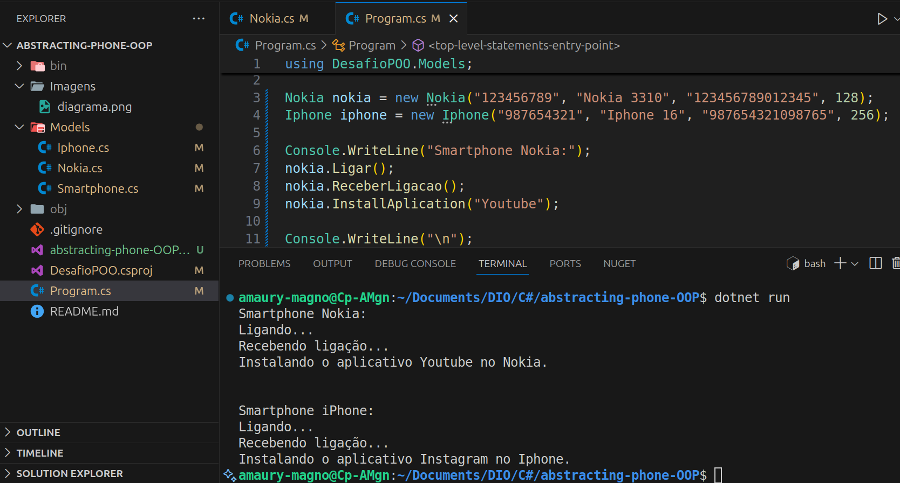

# .NET - Object-Oriented Programming
## Project Challenge
This project aims to demonstrate Object-Oriented Programming (OOP) concepts using .NET.

## Context
The goal of this project is to model a basic phone system using OOP principles. It includes an abstract class representing a generic phone, and concrete classes representing different brands and models that inherit from this base class.

## Class Diagram

## Requirements
1. The Smartphone class must be abstract, meaning it cannot be instantiated directly and should serve only as a base model.
2. The Nokia and iPhone classes must inherit from the Smartphone class.
3. The InstallApplication method must be overridden in both the Nokia and iPhone classes, as each brand has a different way of installing applications.

## TestCode
